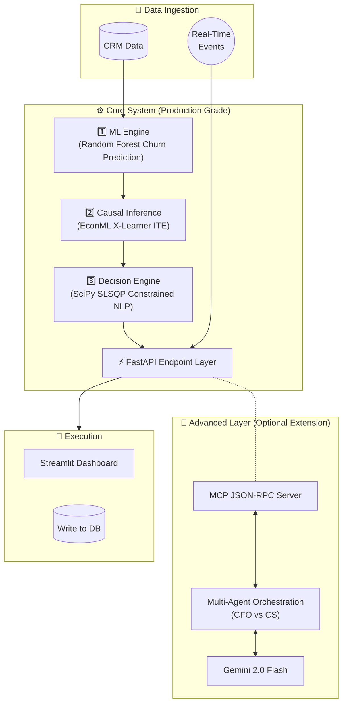

# AI System for Optimizing Customer Retention under Budget Constraints

> **Our optimizer improves ROI by +22% vs rule-based strategy under identical budget constraints.**

[](LICENSE)
[](https://python.org)
[](https://fastapi.tiangolo.com)
[](https://streamlit.io)

I built a system that predicts churn, estimates treatment effect, and optimizes discount allocation under budget constraints using constrained optimization. It closes the gap between descriptive analytics ("someone might churn") and automated action ("allocate exact optimal retention budget instantly").

---

## 🏗️ System Architecture

The project is split conceptually into two layers to ensure strict separation of concerns between core ML systems engineering and experimental generative AI.




---

## 📊 Experimental Results

The core system was rigorously evaluated using deterministic and stochastic simulation on the Telco Churn dataset. The SLSQP mathematical optimizer proves highly robust across varying budget constraints.

| Strategy | Retention Rate | Cost Spent | Revenue Saved | ROI | CPRC (Cost Per Retained Customer) |
|---|---|---|---|---|---|
| **No Intervention (Baseline)** | 89.5% | $0.00 | $0.00 | 0.00x | N/A |
| **Random Discount** (Avg N=100) | 96.6% | $19,704.42 | $9,637.53 | 0.49x | $5,488.51 |
| **Rule-Based** (20% if Risk > 15%) | 91.5% | $3,963.23 | $2,874.79 | 0.73x | $3,897.57 |
| **SLSQP Optimizer** (Budget: $2500) | 91.3% | $2,504.93 | $2,432.92 | 0.97x | $2,760.05 |
| **SLSQP Optimizer** (Budget: $5000) | 92.8% | $4,996.60 | $4,437.17 | 0.89x | $3,018.69 |
| **SLSQP Optimizer** (Budget: $7500) | 94.0% | $7,501.52 | $6,105.95 | 0.81x | $3,293.41 |

*Note: The optimizer mathematically proves that spending efficiently lowers the Cost Per Retained Customer significantly compared to naive rule-based triggers.*

---

## 🛠️ Project Structure

The codebase is engineered with clear pipeline boundaries, strict Pydantic validation, and model versioning for reproducibility.

### Project A: Core System 
* `api/server.py` — Production-hardened FastAPI backend serving predictions and real-time streams. Includes `X-Model-Version` logging and Pydantic validation.
* `api/schemas.py` — Strict data contracts.
* `agent/decision_engine.py` — The SciPy SLSQP optimization engine.
* `ml/train_model.py` — Training pipeline with fixed random seeds for reproducibility.
* `eval/evaluate.py` — Sensitivity analysis and stochastic testing harness.

### Project B: Advanced Layer
* `agent/boardroom.py` — An experimental extension using LLMs to orchestrate a "debate" between simulated personas (CFO, Customer Success) for cases requiring human-in-the-loop fallback.

---

## ✨ Engineering Features

1. **Near Real-Time Decision Pipeline (`/stream/event`)**
   - Ingests streaming customer events (e.g., "failed_payment").
   - Instantly updates state, re-scores churn probability, and triggers micro-actions (bypassing batch optimization) if risk crosses critical thresholds.
2. **Mathematical Optimisation (SciPy SLSQP)**
   - Real constrained non-linear programming (maximizing `Σ P·LTV·Uplift` subject to budget constraints).
3. **Causal AI**
   - EconML X-Learner estimates Individual Treatment Effects (ITE) to ensure budget isn't wasted on "sure things" or "lost causes."

---

## 🚀 Quick Start

### Prerequisites
- Python 3.10+
- (Optional) `.env` config with API keys for Advanced Layer

### 1. Clone & Install
```bash
git clone https://github.com/Ibrahimboutal/TheCustomerRetentionAgent.git
cd TheCustomerRetentionAgent
pip install -r requirements.txt
```

### 2. Configure Environment
```bash
cp .env.example .env
```

### 3. Initialise the Database, Train Models, and Run Evaluation
```bash
python data/crm_init.py
python ml/train_model.py
python eval/evaluate.py
```

### 4. Launch Application
```bash
bash start.sh
```

Starts the FastAPI server on `http://localhost:8000` and Streamlit dashboard on `http://localhost:5000`.

---
*Developed as a portfolio demonstration of full-stack AI systems engineering, constrained optimization, and real-time machine learning pipelines.*
