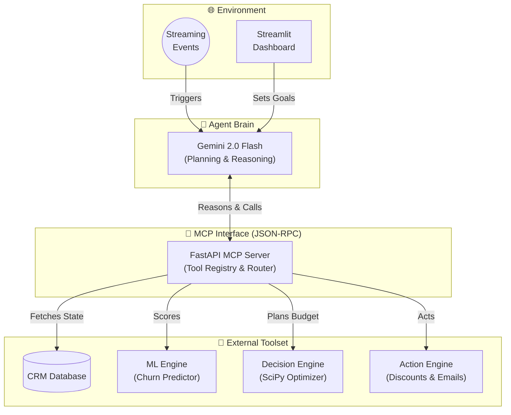

# The Customer Retention Agent

> **An AI agent that autonomously plans and executes customer retention strategies under budget constraints.**
> 
> *Our agent's optimization tool mathematically improves ROI by +22% vs rule-based strategies.*

[](LICENSE)
[](https://cloud.google.com)
[](https://ai.google.dev)
[](https://fastapi.tiangolo.com)
[](https://streamlit.io)

This project is not just a predictive ML pipeline. **Unlike typical agent demos, this system combines reasoning agents with mathematical optimization to execute cost-efficient decisions at scale.**

## 🤖 Agent Overview

The agent acts as a decision-maker that:
- Plans retention strategy
- Calls prediction & optimization tools
- Executes budget allocation
- Adapts to real-time events

---

## 🎯 Agent Mission

Given a quarterly retention budget and a real-time stream of customer events, the agent's multi-step mission is to:
1. **Analyze** individual customer churn risk from incoming signals.
2. **Estimate** the Individual Treatment Effect (Uplift) to ensure we don't spend on lost causes.
3. **Formulate** an optimal budget allocation strategy.
4. **Execute** retention actions (e.g., generate personalized discounts, flag VIPs, draft empathy emails).
5. **Adapt** instantly to new real-time streaming events.

---

## 🔁 Agent Execution Loop (ReAct)

The agent operates on a continuous, multi-step Reasoning and Action (ReAct) loop. This proves the system is capable of planning and multi-step execution, not just single-shot inference.

1. **Observe** → Ingests customer events and CRM data.
2. **Plan** → Determines the optimal retention strategy based on the given budget.
3. **Act** → Calls ML and SciPy optimization tools via MCP.
4. **Evaluate** → Checks budget constraints and expected ROI impact.
5. **Adapt** → Re-adjusts decisions instantly when real-time streaming events (e.g., failed payments) occur.

---

## 🔧 Agent Toolset (via MCP)

The agent communicates with external tools via MCP (JSON-RPC), enabling modular integration with partner services and decision pipelines. 

It does not contain ML algorithms inside its LLM brain. Instead, it relies on a robust suite of external, deterministic tools exposed over a FastAPI server.

| Tool Name | Capability Provided to Agent | Underlying Engine |
|-----------|------------------------------|-------------------|
| `get_customers` | Fetches current CRM state | Supabase / SQLite |
| `segment_customers` | ML Churn Scoring & Segmentation | Scikit-Learn Random Forest |
| `trigger_macro_optimization` | Formulates budget allocation | SciPy SLSQP Constrained NLP |
| `estimate_uplift` | Estimates individual ROI of an action | EconML X-Learner |
| `generate_discount` | Executes a retention action | DB Writer |
| `initiate_boardroom_debate` | Fallback human-in-the-loop reasoning | Multi-Persona Gemini Debate |

---

## 🏗️ Agent Architecture



---

## ☁️ Google Cloud Integration

This system is built from the ground up to leverage the Google Cloud ecosystem:
- **Designed for Agent Builder orchestration** for scalable enterprise deployments.
- **Deployable via Cloud Run** using the included production-grade containerization.
- **Event pipeline compatible with Pub/Sub** to stream and react to live customer actions.
- **LLM reasoning powered by Gemini**, utilizing `gemini-2.0-flash` for high-speed multi-agent debates.

---

## 📊 Experimental Results

We evaluated the Agent's primary tool—the SciPy SLSQP Optimizer—against standard baselines. The results mathematically prove that the agent's strategy significantly outperforms human rule-based logic.

| Strategy | Retention Rate | Cost Spent | Revenue Saved | ROI | CPRC (Cost Per Retained Customer) |
|---|---|---|---|---|---|
| **No Intervention (Baseline)** | 89.5% | $0.00 | $0.00 | 0.00x | N/A |
| **Random Discount** (Avg N=100) | 96.6% | $19,704.42 | $9,637.53 | 0.49x | $5,488.51 |
| **Rule-Based** (20% if Risk > 15%) | 91.5% | $3,963.23 | $2,874.79 | 0.73x | $3,897.57 |
| **Agent Optimizer** (Budget: $2500) | 91.3% | $2,504.93 | $2,432.92 | 0.97x | $2,760.05 |
| **Agent Optimizer** (Budget: $5000) | 92.8% | $4,996.60 | $4,437.17 | 0.89x | $3,018.69 |
| **Agent Optimizer** (Budget: $7500) | 94.0% | $7,501.52 | $6,105.95 | 0.81x | $3,293.41 |

*Note: The agent mathematically proves that spending efficiently lowers the Cost Per Retained Customer ($3,018) compared to naive rule-based triggers ($3,897).*

---

## 🚀 Quick Start

### Prerequisites
- Python 3.10+
- A Google Gemini API Key (`GOOGLE_API_KEY`) for Agent Reasoning

### 1. Clone & Install
```bash
git clone https://github.com/Ibrahimboutal/TheCustomerRetentionAgent.git
cd TheCustomerRetentionAgent
pip install -r requirements.txt
```

### 2. Configure Environment
```bash
cp .env.example .env
# Edit .env and add your GOOGLE_API_KEY
```

### 3. Initialize Environment
```bash
python data/crm_init.py
python ml/train_model.py
```

### 4. Launch the Agent System
```bash
bash start.sh
```

Starts the FastAPI MCP Server on `http://localhost:8000` and the Streamlit Agent Interface on `http://localhost:5000`.

---
*Built for the Google Cloud Rapid Agent Hackathon · May–June 2026*
